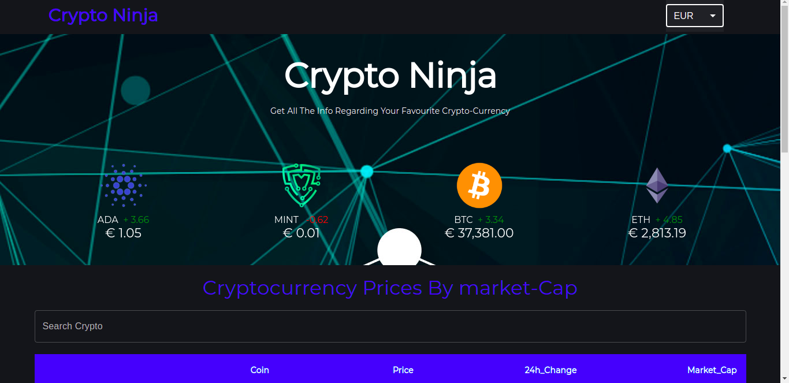

## Ninja Crypto React App

## Demo
#### Here is a working live demo :  https://crypto-ninja.netlify.app/

## Built with 

- [React JS](https://reactjs.org/)
- [Material UI](https://v4.mui.com/)
- [Chart JS](https://reactchartjs.github.io/react-chartjs-2/#/)
- [Gecko API's](https://www.youtube.com/redirect?event=video_description&redir_token=QUFFLUhqbWtEMFpxSlY4SlY2VFREXzVxaGo5RXh3M2dsQXxBQ3Jtc0trdDd0S2RvQXpqdjlPRkZDZFFhaG90czZfcWZRLUhTLVlvX3hpbkowMkdiVjZ5M2tnU2QzRmcwcUFvYjB6VS1DWWRULTNqS2FIdVNIQ3NQYTRfMS14VTZFanktVGc3N1JmaVZEYmw1dHdXRFFwX2NrQQ&q=https%3A%2F%2Fwww.coingecko.com%2Fen%2Fapi)
###I used Context API to manage my currency states

## Made with ♥ By [MAXWEL OCHIENG](https://www.instagram.com/devmaxwel/?hl=en)
